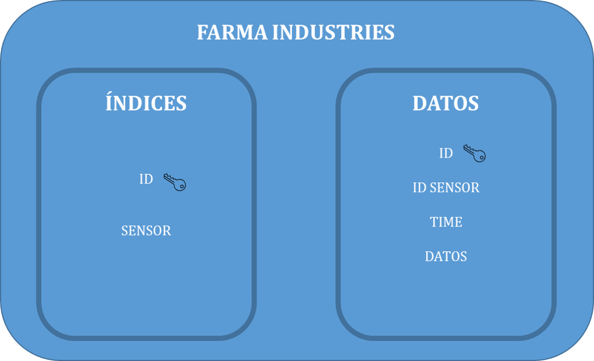
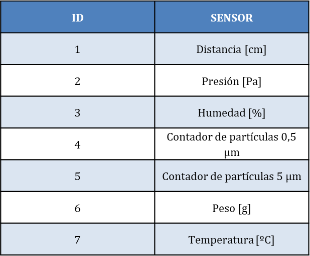
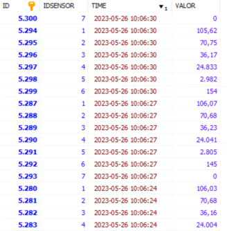

# Farma-Industries
Proyecto IoT (Sistemas de Monitorización y Control)

## Organización de las carpetas:

- Códigos Arduino: archivos creados en Arduino para la programación de los sensores
- Códigos PHP: archivos creados en PHP para modificar la interfaz gráfica GoogleChart
- Códigos Python: archivos creados en Python para la configuración y programación de la RPI

## Base de datos:

- Proyecto "Farma Industries"

  

- Tabla "Inventario"

  

- Tabla "Datos"

  

